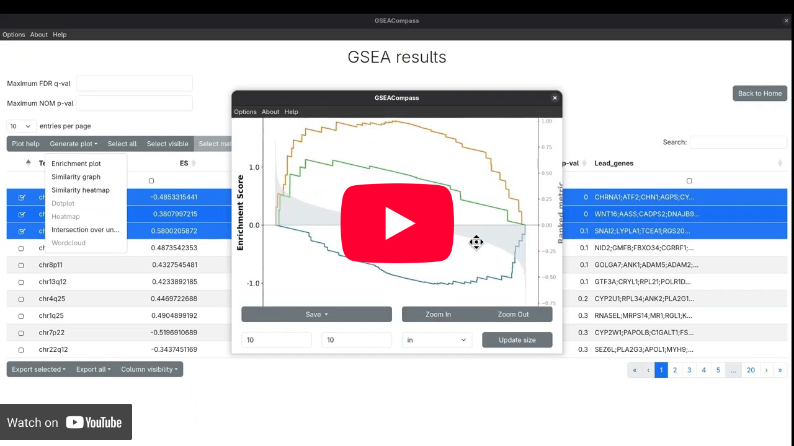

# GSEACompass 🧭

A modern app to run GSEA, pre-ranked GSEA, ssGSEA and GSVA and do post-analysis elaboration on the results.

To know more about how to use GSEACompass, check out the official user manual: [gseacompass.gitbook.io](https://gseacompass.gitbook.io/user-manual)

If you wish to see how to use GSEACompass on a real use-case, watch the following video.
[](https://www.youtube.com/watch?v=H2Jo8MZXmUI)

## Outline

- [Frameworks](#frameworks)
- [For USERS - How to run the software](#for-users---how-to-run-the-software)
- [For DEVELOPERs: How to build from source code](#for-developers---how-to-build-from-source-code)
  - [Download source code](#download-source-code)
  - [Dependencies](#dependencies)
    - [Python](#python)
    - [Node.js](#nodejs)
    - [Python libraries](#python-libraries)
    - [Node.js libraries](#nodejs-libraries)
    - [System](#system)
      - [Ubuntu-based](#ubuntu-based)
      - [Fedora/RHEL](#fedorarhel)
      - [Windows](#windows)
  - [Build and run](#build-and-run)

## Frameworks

This tool is mostly powered by:

- *GSEApy* on the python backend to run genomic analyses and graphical elaborations
- *Electron.js* on the desktop frontend
- *Datatables.js* as a view engine for post-analysis tables
- *Pyvis* as a view engine for similarity graphs

## For USERs - How to run the software

To run GSEACompass, download the executable required by your OS (Ubuntu-based, Mac, Windows) from the [*Releases*](https://github.com/DEIB-GECO/GSEACompass/releases) page and double click on it. A detailed guide is available in the official user manual, in the section [Install](https://gseacompass.gitbook.io/user-manual).

To get familiar with the required input expression formats, example datasets can be retrieved from [here](https://www.gsea-msigdb.org/gsea/datasets.jsp).

## For DEVELOPERs - How to build from source code

### Download source code

Download GSEACompass source code from Github

### Dependencies

Make sure, before running GSEAWrap in a development enviroment, to fulfill these dependencies.

#### Python

Python3.12 and pip must be installed, follow the official guides to install them ([Python](https://www.python.org/downloads/), [pip](https://pypi.org/project/pip/)).

#### Node.js

Node.js is required in order to build and run this application. As suggested on the official Electron.js website:
> Please install Node.js using pre-built installers for your platform. You may encounter incompatibility issues with different development tools otherwise.
>
Follow the [official guide](https://nodejs.org/en/download) to install it.

#### Python libraries

Once Python and pip are installed, open the directory in which you have unzipped the GSEACompass archive and run the command:

```bash
pip install -r requirements.txt
```

This will install all the python-based dependencies needed to run the app.

#### Node.js libraries

Once installed Node.js, all npm-based dependencies can be installed with the following command, make sure to be in your local repository directory:

```bash
npm install
```

#### System

The follow system dependencies are required, install only those regarding your operating system:

##### Ubuntu-based

Run the following command if your OS is Ubuntu or Ubuntu-based:

```bash
sudo apt install python3-devel
```

##### Fedora/RHEL

Run the following command if your OS is Fedora or similar:

```bash
sudo dnf install libquadmath libquadmath-devel
```

##### Windows

Make sure that Python is in the PATH environment variable.

### Build and run

To build and run the application just run the following command, make sure to be in the repository directory:

```bash
npm start run
```
